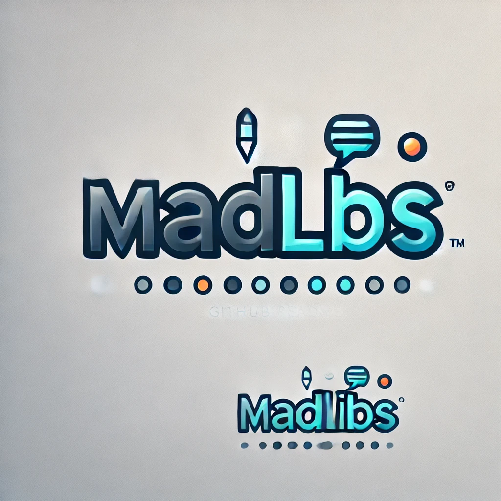

<a id="readme-top"></a>

<div align="center">
  <a href="https://github.com/Loggster1/MadLibs">
    
  </a>

  <h3 align="center">MadLibs Game</h3>

  <p align="center">
      A fun interactive program that generates random stories based on user input.
    <br />
    <br />
    <br />
  </p>
</div>

<details>
  <summary>Table of Contents</summary>
  <ol>
    <li><a href="#about-the-project">About The Project</a></li>
    <li><a href="#getting-started">Getting Started</a></li>
    <li><a href="#features">Features</a></li>
    <li><a href="#technologies">Technologies</a></li>
    <li><a href="#license">License</a></li>
    <li><a href="#support">Support</a></li>
  </ol>
</details>

# About The Project
This is an interactive MadLibs game built in Java. Users will be prompted to enter different parts of speech (nouns, verbs, adjectives, etc.), and then a random story will be generated with those inputs. It's a great way to practice creativity and have some fun. Right now it doesn't have a GUI, so the user interacts with it via command line.

# Features
| Features | Description |
| ------- | ----------- |
| **Story Generation** | User inputs different words (nouns, verbs, adjectives) to complete a story template. |
| **Multiple Stories** | Includes multiple stories to generate a variety of madlibs. To add your own, follow the structure of an already created file and add it to your MadLibsFiles folder |
| **Interactive CLI** | User-friendly command-line interface where users input words and receive their unique story. |

# Getting Started
#### Prerequisites
* Java must be installed on your system (JDK 20+)

#### Download the Project
To get started, you can download the project as a `.zip` file by clicking the code button at the top of the page:

1. Go to the project’s <a href="https://github.com/Loggster1/MadLibs">home page</a>
2. Select the green **Code** button at the top right of the page
3. Select `Download ZIP` at the bottom of the dropdown menu

#### Extract the Files
Once the `.zip` file is downloaded, you will need to extract it:

1. Locate the `.zip` file wherever you downloaded it
2. Right-click and select **Extract All...**
3. Choose where to extract the files to

#### Compile the Java Files
Once you have downloaded and extracted the project, you will need to compile the Java files in order for it to run:

1. Open your command prompt
2. Go to the folder where the project was extracted (use `cd path/to/folder` where `path/to/folder` is the location of the folder)
3. Run the following command to compile the necessary files:

   ```bash
   javac MadLibs.java
4. To run the program, use the following command:
   
   ```bash
   java MadLibs

# Technologies

* Java
* JDK 20+
* Github
* Netbeans

# License
This project is licensed under the [GNU General Public License v3.0](https://www.gnu.org/licenses/gpl-w.0.en.html).

# Support
[![LinkedIn][linkedin-shield]][linkedin-url]

logan@loggster.dev


[linkedin-shield]: https://img.shields.io/badge/-LinkedIn-black.svg?style=for-the-badge&logo=linkedin&colorB=555
[linkedin-url]: https://linkedin.com/in/logan-wallarab


<p align="right">(<a href="#readme-top">back to top</a>)</p>
